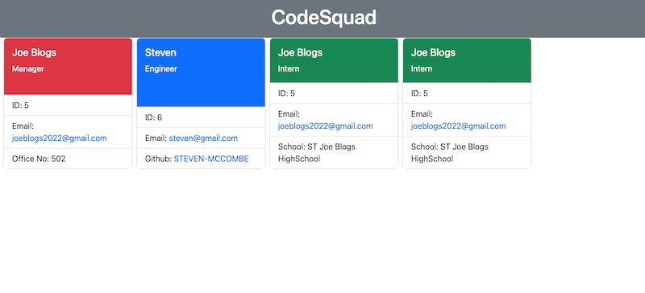

# CodeSquad Generator

## Description
This project is a command line application used to generate a html page that displays team members. The application will prompt the user to input the details of the team members and their particular roles.

## Table of Contents
* [Installation](#installation)
* [Usage](#usage)
* [License](#license)
* [Contribute](#contribute)
* [Tests](#tests)
* [Questions](#questions)

## Installation
- Package.json```$npm init -y``` , 
- Dependencies ```$npm i inquirer@8.2.4``` , 
- Jest testing ```$npm i --save-dev jest```

## Usage
Run the generator using ```$node index.js```

Walk-Through Video: [Click here](https://drive.google.com/file/d/1SpjgzFP_oGvEexIzSSWfZ6wcoL_AetnB/view)

Application Screenshot:

 

## License 
   

  [Read more about MIT License here.](https://opensource.org/licenses/MIT)
  
  

## Contribute
N/A

## Tests
Run tests using ```$npm test```

## Questions
Contact Links:
- [Github Profile](https://github.com/STEVEN-MCCOMBE)
- [E-mail Me](mailto:smccombe93@gmail.com)

